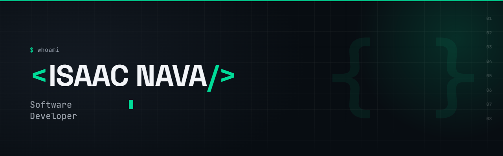

<div align="center">



</div>

---

## About Me

I manage the daily operations of a watch and phone repair shop — and I build
the software that solves the problems I see there every day.

My first "system" was a spreadsheet: an inventory tracker I built for the shop,
which cut stock losses from around half of some batches to almost zero. That's
when I understood that software is just organized problem solving. I've been
learning to build the real thing since.

**Currently building:** an offline-first point of sale system, because the small
shops I work with can't depend on the internet.

---

## Featured Projects

### 🧾 POS System — Watch & Accessories Shop
Sales and inventory management for a real business. Runs fully offline on a
single machine, prints receipts on a thermal printer, and exports reports to Excel.

**Impact:** replaces a manual notebook process for daily sales tracking.
**Stack:** Node.js · Express · SQLite · MVC + service layer

### 🏆 Mis Reconocimientos — Full-Stack CRUD
A personal achievements manager with create, read, update and delete operations
and a dark editorial interface.

**Stack:** React · Vite · Express · JSON file storage

### 📊 Inventory Control System — Excel
Stock tracking system built for a real shop with minimum-stock alerts.

**Impact:** reduced stock losses from ~50% of some batches to near zero.
**Stack:** Excel · Formulas · Data validation

---

## Tech Stack

<div align="center">

**Frontend**


**Backend & Database**


**Tools**


</div>

---

## GitHub Analytics

<div align="center">


</div>
---

## Currently Learning

```js
const isaac = {
  focus:      "JavaScript ecosystem",
  learning:   ["Node.js", "React", "SQL", "QA fundamentals"],
  next:       "Deploying my POS system for a real client",
  goal:       "First junior role in web development or QA",
  languages:  ["Spanish (native)", "English (learning)"]
};
```

---

## Let's Connect

<div align="center">

I'm open to junior opportunities in web development, QA and data analysis.

[](mailto:enriqueisaacn@gmail.com)
[](https://www.linkedin.com/in/enrique-isaac-nava-ponce-de-león-636509233)

</div>
